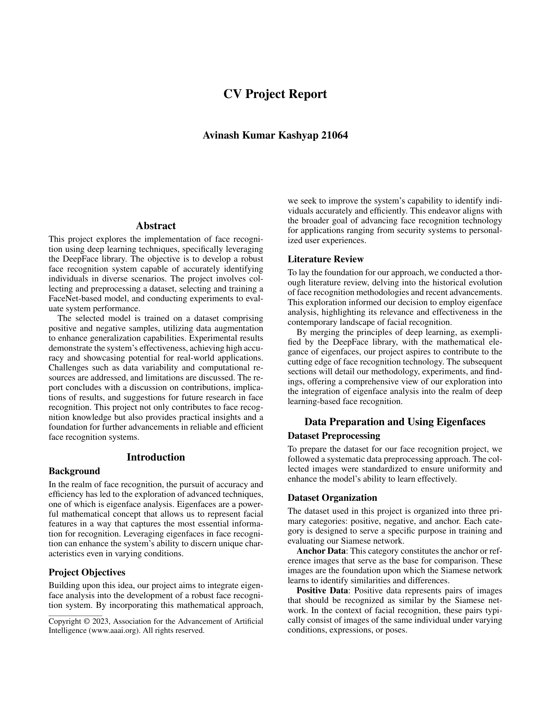
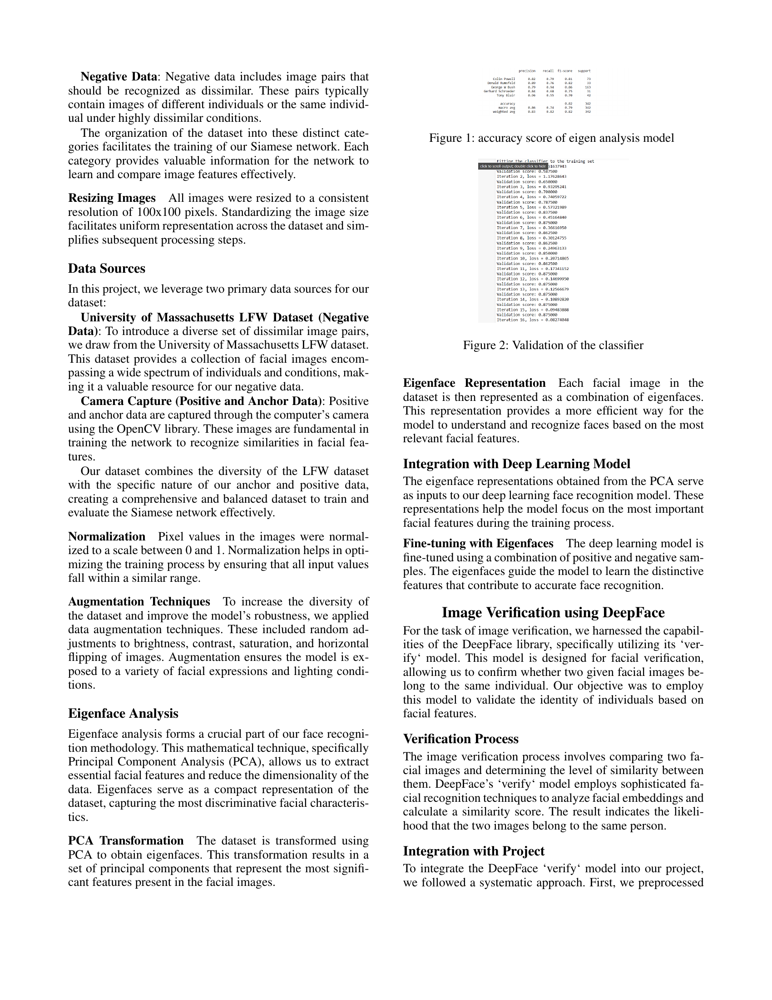

# 🧠 Face Recognition Using Deep Learning & Eigenfaces

A Computer Vision project by **Avinash Kumar Kashyap (Roll No: 21064)**  
This project presents a hybrid facial recognition system combining deep learning (Siamese Network + FaceNet) and classical eigenface analysis (PCA), enhanced by DeepFace for real-world identity verification.

---

## 📌 Table of Contents

- [🎯 Project Objective](#-project-objective)
- [🧠 Background & Motivation](#-background--motivation)
- [🗂️ Dataset Preparation](#️-dataset-preparation)
- [📊 Eigenface Analysis (PCA)](#-eigenface-analysis-pca)
- [⚙️ Model Architecture](#️-model-architecture)
- [🧪 Training & Evaluation](#-training--evaluation)
- [🧾 DeepFace Integration](#-deepface-integration)
- [📈 Results & Metrics](#-results--metrics)
- [📸 Visualizations](#-visualizations)
- [🚀 Future Work](#-future-work)
- [📁 Project Structure](#-project-structure)
- [🧾 License](#-license)

---

## 🎯 Project Objective

To build a robust facial recognition system that:
- Uses **Siamese Network** with FaceNet to measure similarity.
- Incorporates **Eigenfaces (PCA)** for dimensionality reduction.
- Employs **DeepFace** for robust face verification.
- Handles real-world scenarios like pose, lighting, and expressions.

---

## 🧠 Background & Motivation

Facial recognition is key in modern authentication systems. By combining the classical strength of eigenfaces with the learning power of neural networks, this project aims to build a highly reliable hybrid system.

---

## 🗂️ Dataset Preparation

### 📁 Data Structure
- **Anchor**: Base reference face
- **Positive**: Same person, different images
- **Negative**: Different person (LFW dataset)

### 🧹 Preprocessing
- Resize: `100x100`
- Normalize: `[0, 1]`
- Augmentation: Brightness, Contrast, Flip

**Workflow Diagram**  

---

## 📊 Eigenface Analysis (PCA)

- Principal Component Analysis applied to face crops
- Reduced dimensionality while preserving key identity features
- Eigenfaces used as compact input to the deep model

**Eigenface Output**  

---

## ⚙️ Model Architecture

### 🧬 Siamese Network with FaceNet Embeddings

# Computer-vision-
